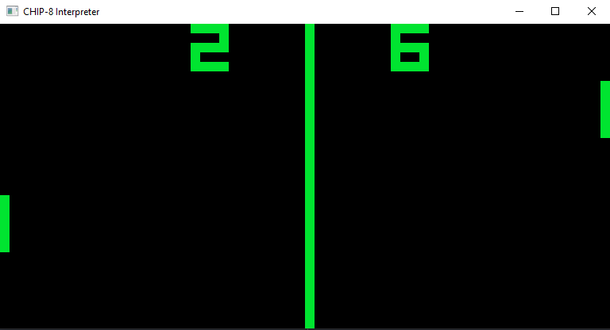

# CHIP-8 Interpreter

My second take on writing CHIP-8 Interpreter, where with this one what I had in mind was learning different topics.
Includes type safety, testing, somewhat clean architecture and overengineering for educational purposes.

## Building and Running

Built using g++ 15.2 and ninja.

```bash
# Configure
cmake -B build -G "Ninja" -DCMAKE_C_COMPILER=gcc -DCMAKE_CXX_COMPILER=g++ -DCMAKE_BUILD_TYPE=Release

# Build
cmake --build build

# Run tests
cd build && ctest --output-on-failure

# Run emulator
./build/chip8 -h
```

## Showcase
Below is screenshot of Pong game successfully running (ROM is available in roms/ directory):  


## Controls
